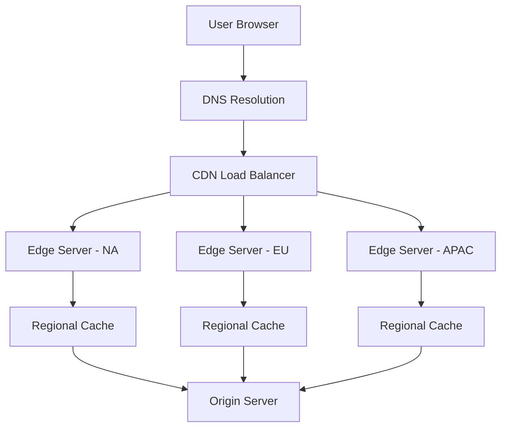

## What is a CDN?

A Content Delivery Network (CDN) refers to geographically distributed servers (also called edge servers) that provide fast delivery of static and dynamic content.

<Info>
  CDNs are distributed server networks that help improve the performance, reliability, and security of content delivery on the internet.
</Info>


## How CDN Works


Suppose Bob in New York wants to visit an eCommerce website deployed in London. Without a CDN, the request would go to London servers, resulting in slow response times. With a CDN, content is loaded from a nearby CDN server.

### CDN Request Flow

Here's what happens when a user requests content through a CDN:

<Steps>
  <Step title="User enters URL">
    Bob types `www.myshop.com` in the browser. The browser looks up the domain name in the local DNS cache.
  </Step>
  
  <Step title="DNS Resolution">
    If not in local cache, the browser queries the DNS resolver (usually at the ISP) to resolve the domain name.
  </Step>
  
  <Step title="Recursive DNS Lookup">
    The DNS resolver recursively resolves the domain name and asks the authoritative name server.
  </Step>
  
  <Step title="CDN Alias">
    The authoritative name server returns an alias pointing to `www.myshop.cdn.com` (the CDN domain) instead of the origin server.
  </Step>
  
  <Step title="CDN Domain Resolution">
    The DNS resolver asks the authoritative name server to resolve `www.myshop.cdn.com`.
  </Step>
  
  <Step title="Load Balancer Response">
    The authoritative name server returns the domain for the CDN load balancer `www.myshop.lb.com`.
  </Step>
  
  <Step title="Optimal Edge Server Selection">
    The CDN load balancer chooses an optimal edge server based on:
    - User's IP address
    - User's ISP
    - Content requested
    - Server load
  </Step>
  
  <Step title="Edge Server IP Returned">
    The CDN load balancer returns the optimal edge server's IP address.
  </Step>
  
  <Step title="Content Delivery">
    The browser connects to the edge server to load content.
  </Step>
</Steps>

## CDN Distribution Network

If the edge CDN server cache doesn't contain the requested content:

<Accordion title="CDN Cache Hierarchy" icon="layer-group">
  1. **Edge Server** (closest to user) - First check
  2. **Regional CDN Server** - If not found at edge
  3. **Central CDN Server** - If not found at regional
  4. **Origin Server** - Final fallback (e.g., London web server)
  
  This hierarchy ensures content is served from the closest available location.
</Accordion>

## Types of Cached Content

<CardGroup cols={2}>
  <Card title="Static Content" icon="image">
    - Static HTML pages
    - Images and graphics
    - Videos and media files
    - CSS stylesheets
    - JavaScript files
    - Fonts
  </Card>
  
  <Card title="Dynamic Content" icon="bolt">
    - Edge computing results
    - Personalized content
    - API responses
    - Real-time data
    - Geolocation-based content
  </Card>
</CardGroup>

## Key CDN Concepts

### Edge Servers

Edge servers are located closer to end users than traditional servers, which helps:

- **Reduce latency**: Shorter physical distance = faster response times
- **Improve performance**: Less network hops between user and content
- **Handle traffic spikes**: Distribute load across multiple servers
- **Increase availability**: Redundancy through geographic distribution

### Edge Computing

Edge computing processes data closer to the end user rather than in a centralized data center.

<Tabs>
  <Tab title="Benefits">
    - Reduced latency for real-time applications
    - Lower bandwidth usage to origin
    - Better user experience
    - Support for compute-intensive tasks at the edge
  </Tab>
  
  <Tab title="Use Cases">
    - Video streaming transcoding
    - Image optimization and resizing
    - A/B testing at the edge
    - Personalization logic
    - Bot detection and filtering
    - Authentication and authorization
  </Tab>
</Tabs>

## CDN Benefits

<AccordionGroup>
  <Accordion title="Performance Improvement" icon="gauge-high">
    **Faster Load Times:**
    - Content served from geographically closer servers
    - Reduced network latency
    - Optimized delivery paths
    
    **Example:** A user in Sydney accessing a US-based website can see load times improve from 2-3 seconds to under 500ms.
  </Accordion>
  
  <Accordion title="Reliability & Availability" icon="shield-check">
    **High Availability:**
    - Multiple redundant servers
    - Automatic failover
    - No single point of failure
    
    **DDoS Protection:**
    - Distributed architecture absorbs attacks
    - Rate limiting at edge
    - Anomaly detection
  </Accordion>
  
  <Accordion title="Scalability" icon="chart-line">
    **Handle Traffic Spikes:**
    - Distribute load across many servers
    - Automatic scaling
    - Reduced origin server load
    
    **Cost Efficiency:**
    - Lower bandwidth costs at origin
    - Reduced infrastructure needs
    - Pay for what you use
  </Accordion>
  
  <Accordion title="Security" icon="lock">
    **Enhanced Security:**
    - SSL/TLS termination at edge
    - Web Application Firewall (WAF)
    - Bot mitigation
    - Certificate management
  </Accordion>
</AccordionGroup>

## Popular CDN Use Cases

### Video Streaming

```javascript
// HLS video streaming configuration
{
  "cdn": "cloudfront",
  "format": "HLS",
  "qualities": ["720p", "1080p", "4K"],
  "edge_caching": true,
  "cache_duration": "7d"
}
```

CDNs enable:
- Adaptive bitrate streaming
- Reduced buffering
- Lower latency for live streams
- Global reach for content

### Website Acceleration

```html
<!-- Serve static assets from CDN -->
<link rel="stylesheet" href="https://cdn.example.com/styles/main.css">
<script src="https://cdn.example.com/js/app.bundle.js"></script>

```

### API Acceleration

```javascript
// Cache API responses at the edge
const response = await fetch('https://api.example.com/products', {
  headers: {
    'Cache-Control': 'public, max-age=3600'
  }
});
```

### Software Distribution

CDNs excel at distributing:
- Software updates
- Mobile app bundles
- Game patches
- Operating system images

## CDN Cache Control

### HTTP Cache Headers

<CodeGroup>
```http HTTP Response Headers
HTTP/1.1 200 OK
Cache-Control: public, max-age=31536000, immutable
ETag: "33a64df551425fcc55e4d42a148795d9f25f89d4"
Expires: Wed, 21 Oct 2025 07:28:00 GMT
Last-Modified: Tue, 15 Nov 2024 12:45:26 GMT
```

```javascript Cache-Control Directives
// Public cacheable for 1 hour
Cache-Control: public, max-age=3600

// Private, not cacheable by CDN
Cache-Control: private, no-cache

// Revalidate before use
Cache-Control: public, max-age=3600, must-revalidate

// Immutable (never changes)
Cache-Control: public, max-age=31536000, immutable
```
</CodeGroup>

### Cache Invalidation

<Tabs>
  <Tab title="Time-based">
    Content automatically expires after TTL:
    ```
    Cache-Control: max-age=3600  # 1 hour
    ```
  </Tab>
  
  <Tab title="Manual Purge">
    Explicitly clear cached content:
    ```bash
    # Purge specific URL
    curl -X PURGE https://cdn.example.com/style.css
    
    # Purge by tag
    cloudflare-cli purge --tags "product-123"
    ```
  </Tab>
  
  <Tab title="Versioning">
    Use versioned URLs:
    ```html
    <!-- Old version cached, new version has different URL -->
    <link href="/css/style.v2.css" rel="stylesheet">
    <script src="/js/app.v2.js"></script>
    ```
  </Tab>
</Tabs>

## Cloud Gaming and Streaming

Cloud gaming uses CDN technology to provide users with high-quality, low-latency gaming experiences:

<CardGroup cols={2}>
  <Card title="Low Latency" icon="bolt">
    Edge servers reduce input lag for responsive gameplay
  </Card>
  <Card title="High Bandwidth" icon="gauge">
    Deliver high-quality video streams for 4K gaming
  </Card>
  <Card title="Global Reach" icon="earth-americas">
    Enable gaming from anywhere in the world
  </Card>
  <Card title="Scalability" icon="arrows-maximize">
    Handle millions of concurrent players
  </Card>
</CardGroup>

## Real-World CDN Architecture



## Major CDN Providers

<AccordionGroup>
  <Accordion title="Cloudflare" icon="cloud">
    - 300+ edge locations
    - Free tier available
    - DDoS protection included
    - Workers for edge computing
  </Accordion>
  
  <Accordion title="AWS CloudFront" icon="aws">
    - 450+ Points of Presence
    - Deep AWS integration
    - Lambda@Edge for compute
    - Pay-as-you-go pricing
  </Accordion>
  
  <Accordion title="Akamai" icon="globe">
    - 4,100+ PoPs worldwide
    - Enterprise-focused
    - Advanced security features
    - Media delivery expertise
  </Accordion>
  
  <Accordion title="Fastly" icon="bolt">
    - Real-time purging
    - Edge computing platform
    - Instant configuration updates
    - Developer-friendly
  </Accordion>
</AccordionGroup>

## Best Practices

<Warning>
  Improper cache configuration can lead to serving stale content or unnecessary origin requests.
</Warning>

<Steps>
  <Step title="Set appropriate TTLs">
    Balance freshness with cache efficiency. Static assets can have longer TTLs (days/weeks), while dynamic content needs shorter TTLs (minutes/hours).
  </Step>
  
  <Step title="Use cache-friendly URLs">
    Include version numbers or content hashes in URLs for better cache control:
    ```
    /assets/app.v2.1.5.js
    /images/logo.a3f5c9.png
    ```
  </Step>
  
  <Step title="Implement cache warming">
    Pre-populate CDN caches with frequently accessed content before traffic spikes.
  </Step>
  
  <Step title="Monitor cache performance">
    Track key metrics:
    - Cache hit ratio
    - Origin offload percentage
    - Edge response times
    - Bandwidth savings
  </Step>
  
  <Step title="Secure your CDN">
    - Enable HTTPS everywhere
    - Use signed URLs for protected content
    - Implement rate limiting
    - Configure WAF rules
  </Step>
</Steps>

## Performance Optimization

<Tabs>
  <Tab title="Image Optimization">
    ```html
    <!-- Modern image formats -->
    <picture>
      <source srcset="/cdn/image.avif" type="image/avif">
      <source srcset="/cdn/image.webp" type="image/webp">
      
    </picture>
    ```
    
    - Automatic format conversion
    - Responsive image sizing
    - Lazy loading support
  </Tab>
  
  <Tab title="Compression">
    Enable compression at the edge:
    ```http
    Content-Encoding: br  # Brotli compression
    Content-Encoding: gzip
    ```
    
    - Brotli for text content (20-30% better than gzip)
    - Gzip fallback for older browsers
    - Pre-compressed assets
  </Tab>
  
  <Tab title="HTTP/2 & HTTP/3">
    Modern protocols improve performance:
    - Multiplexing (multiple requests over single connection)
    - Server push
    - Header compression
    - QUIC protocol (HTTP/3)
  </Tab>
</Tabs>

<Note>
  CDNs are transforming how we access and consume digital content, providing faster, more reliable, and more immersive experiences for users worldwide.
</Note>

## Next Steps

<CardGroup cols={2}>
  <Card title="Redis Caching" icon="database" href="/guides/caching/redis">
    Learn about in-memory caching with Redis
  </Card>
  <Card title="Caching Strategies" icon="diagram-project" href="/guides/caching/strategies">
    Explore different caching patterns
  </Card>
  <Card title="Cache Eviction" icon="trash" href="/guides/caching/cache-eviction">
    Understand cache eviction policies
  </Card>
</CardGroup>
